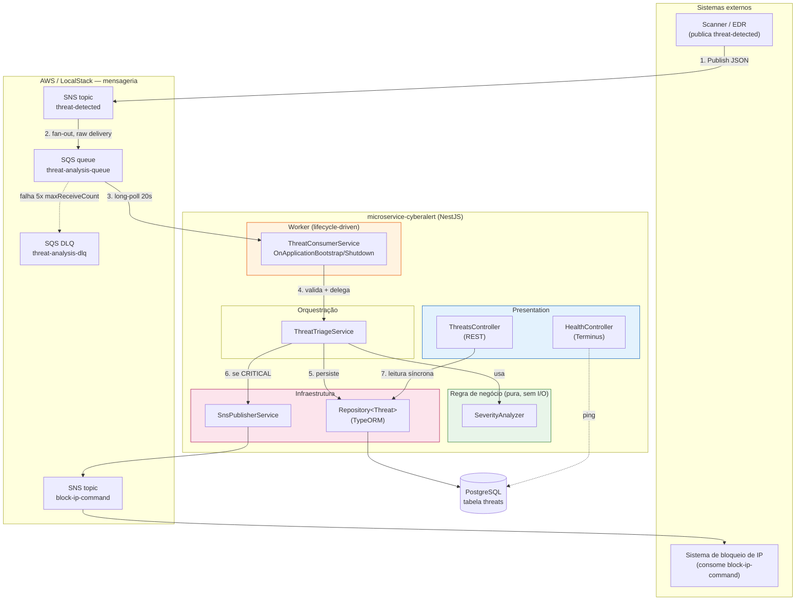
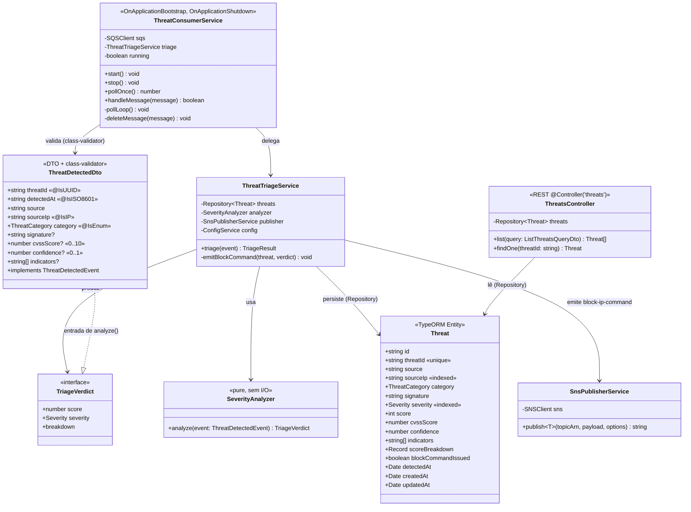
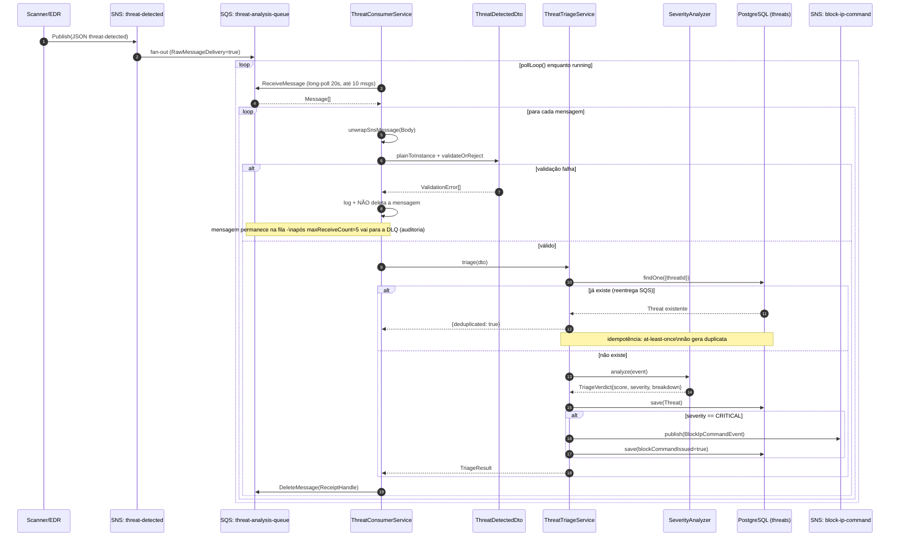
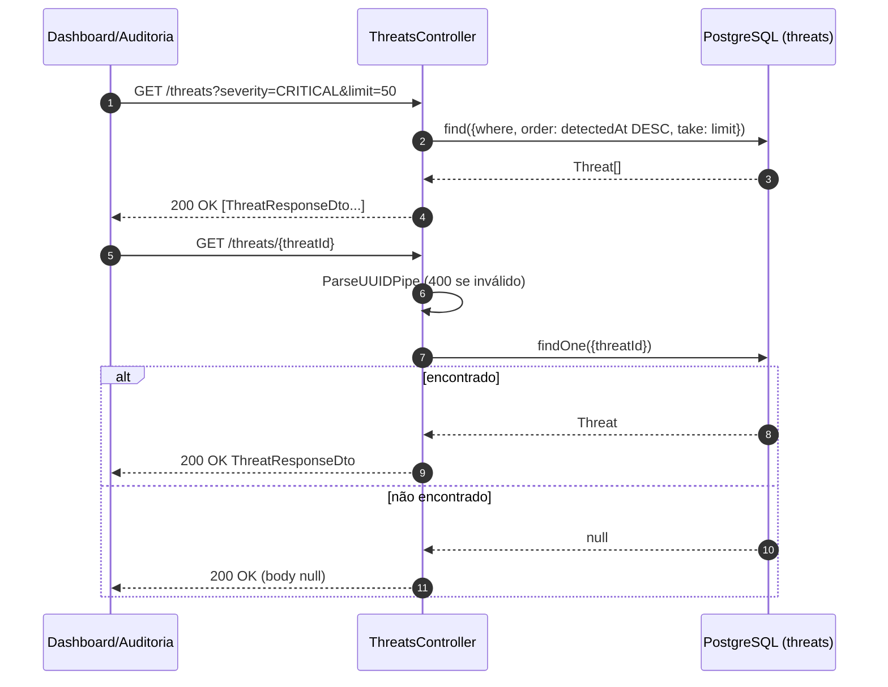
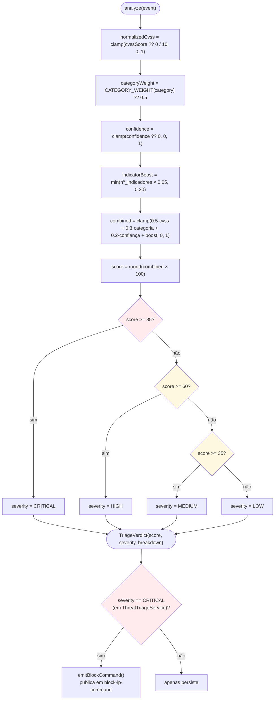
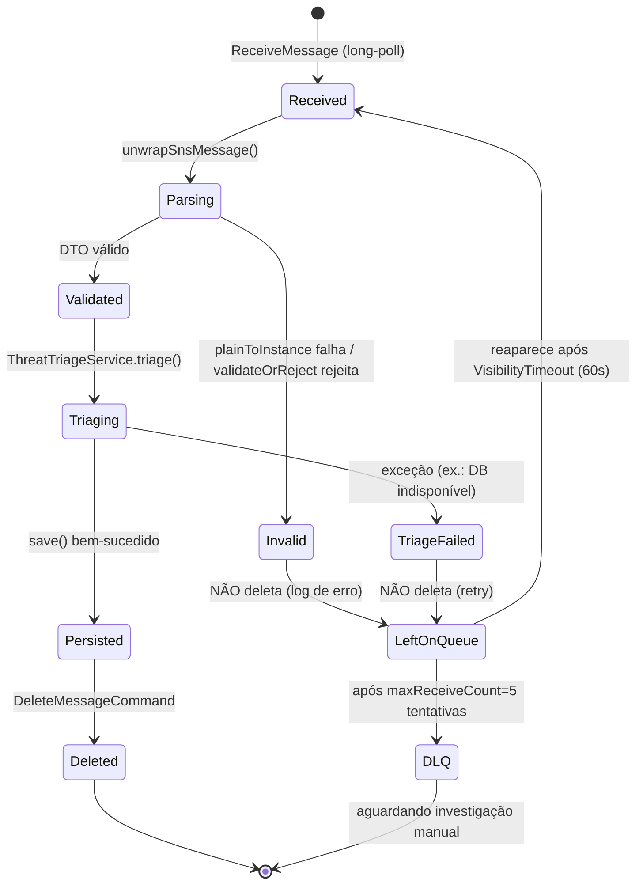
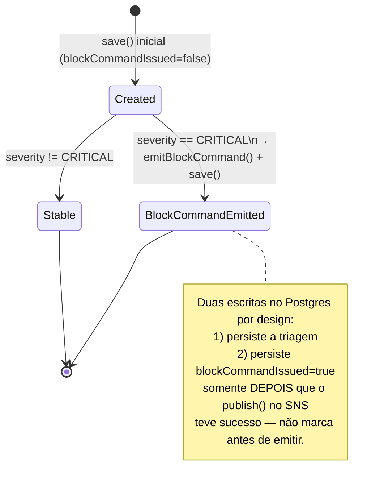

# Fluxograma da Aplicação — Threat Triage & Alerts Engine

**Repositório:** `microservice-cyberalert` · **Porta:** 3001 · **Protocolo:** REST (leitura) + Worker SQS (escrita)

Este documento descreve a aplicação inteira através de diagramas UML (componentes, classes,
sequência, atividades e estados), cada um seguido de uma explicação do **porquê** da decisão de
design — não apenas do "o quê". Os diagramas usam a sintaxe [Mermaid](https://mermaid.js.org/),
renderizada nativamente pelo GitHub/GitLab; a notação segue UML 2.x (setas de composição/agregação,
`<<interface>>`, guardas `[condição]`, etc.).

---

## 1. Diagrama de componentes — arquitetura em camadas

**Por quê esta forma e não Clean Architecture estrita?** O serviço é pequeno e de responsabilidade
única (triar e persistir um evento). Introduzir portas/interfaces só para desacoplar o TypeORM
adicionaria uma camada de indireção sem ganho de testabilidade prático — o `Repository<Threat>` do
TypeORM já é mockável em testes unitários via `getRepositoryToken`. Em vez disso, o esforço de
isolamento foi investido onde ele importa: o `SeverityAnalyzer` é **mantido puro** (sem
dependências de I/O), o que o torna 100% testável com tabelas de entrada/saída, sem mocks.

---

## 2. Diagrama de classes

**Por quê `SeverityAnalyzer` é uma classe separada do `ThreatTriageService`?**
Separação de responsabilidades (SRP): `SeverityAnalyzer` decide **o quê** (pontuação), o
`ThreatTriageService` decide **o que fazer com o resultado** (idempotência, persistência,
publicação condicional). Isso permite testar o algoritmo de scoring isoladamente com dezenas de
casos de tabela sem precisar de um banco de dados ou de um SQS/SNS mockado.

**Por quê `ThreatDetectedDto implements ThreatDetectedEvent`?**
O `ThreatDetectedEvent` é o contrato de domínio (interface pura); o DTO adiciona os decorators de
`class-validator` para validação **na borda** (fronteira de I/O). Isso mantém o domínio livre de
anotações de framework, ao mesmo tempo em que garante que nenhum dado malformado atravesse a
fronteira do worker.

---

## 3. Diagrama de sequência — caminho de escrita (evento → triagem → persistência → bloqueio)

**Por quê a mensagem só é deletada no fim (linha 23), e não logo após o `ReceiveMessage`?**
Semântica **at-least-once** do SQS: se o processo cair entre o recebimento e a deleção, a
mensagem volta a ficar visível após o `VisibilityTimeout` (60s) e é reprocessada. Deletar cedo
demais arriscaria perda silenciosa de dado num crash; deletar tarde demais (só aqui) garante que
"processado" e "confirmado" sejam a mesma operação atômica do ponto de vista de efeitos observáveis
(a idempotência em `findOne(threatId)` cobre o caso de reprocessamento duplicado).

**Por quê validação falha não deleta a mensagem?**
Ao invés de silenciosamente descartar uma mensagem malformada (perda de dado sem rastro), ela é
deixada na fila. Depois de `maxReceiveCount=5` tentativas, o SQS a redireciona automaticamente
para a DLQ (`threat-analysis-dlq`), onde fica disponível para investigação manual — essencial num
pipeline de segurança, onde uma mensagem descartada pode ser justamente um ataque relevante com
payload malformado propositalmente.

---

## 4. Diagrama de sequência — caminho de leitura (REST)

**Por quê não-encontrado retorna `200` com corpo `null` em vez de `404`?**
Decisão deliberada de simplicidade (KISS) documentada no Swagger (`@ApiNotFoundResponse`
descreve exatamente esse comportamento): o cliente não precisa tratar `404` como um caso de erro
HTTP separado — apenas checar se o corpo é `null`. Não há alteração de estado envolvida na
consulta, então não há semântica de "recurso ausente" a proteger via status code.

---

## 5. Diagrama de atividades — algoritmo de pontuação de severidade

**Por quê um modelo de soma ponderada em vez de um modelo de ML/heurística opaca?**
Pipeline de segurança exige **auditabilidade e reprodutibilidade**: dado o mesmo evento de
entrada, o score tem que ser sempre o mesmo, e cada contribuição (`cvss`, `category`,
`confidence`, `indicatorBoost`) é persistida em `scoreBreakdown` — um analista consegue explicar
exatamente por que um evento recebeu determinada severidade, sem precisar reverter um modelo
caixa-preta. Os pesos (`cvss=0.5`, `category=0.3`, `confidence=0.2`) refletem a prioridade do
CVSS como sinal técnico primário, com a categoria da ameaça como segundo fator mais importante.

**Por quê o `indicatorBoost` é somado fora dos 3 pesos-base (que já somam 1.0) em vez de
substituir parte deles?**
Presença de IOCs (indicadores de comprometimento) é um sinal reforçador, não substitutivo — um
evento com CVSS/categoria/confiança medianos, mas múltiplos indicadores concretos, deve poder
escalar de severidade sem que isso dilua os outros fatores. O boost é limitado a 0.20 (`clamp`
final) para não permitir que indicadores, isoladamente, levem um evento fraco a CRITICAL.

---

## 6. Diagrama de estados — ciclo de vida de uma mensagem SQS

**Por quê existem dois caminhos de falha distintos (`Invalid` vs `TriageFailed`) que convergem no
mesmo destino (`LeftOnQueue`)?**
Ambos precisam do mesmo comportamento observável (não deletar, permitir redrive), mas têm causas
raiz diferentes — uma é erro de dado (mensagem malformada, não deve ser reprocessada com
sucesso jamais) e a outra é erro transitório de infraestrutura (banco fora do ar, deve funcionar
no próximo retry). O log distingue as duas causas para facilitar o diagnóstico operacional, mesmo
compartilhando o efeito colateral.

---

## 7. Diagrama de estados — entidade `Threat` (campo `blockCommandIssued`)

**Por quê duas escritas (`save()`) em vez de setar `blockCommandIssued` na primeira inserção?**
Ordem de operações deliberada: só marcar o comando como emitido **depois** que
`SnsPublisherService.publish()` retornou com sucesso evita um estado inconsistente onde o registro
diz "comando emitido" mas o SNS nunca recebeu o publish (ex.: falha de rede entre o `save()`
inicial e o `publish()`). O preço é uma segunda escrita no banco por evento crítico — aceitável
dado o volume esperado desse tipo de evento (severidade mais rara).

---

## 8. Tabela-resumo de decisões de design ("porquês")

| Decisão | Alternativa descartada | Motivo |
|---|---|---|
| Modelo de scoring por soma ponderada, com `scoreBreakdown` persistido | Modelo de ML / heurística opaca | Auditabilidade: pipeline de segurança precisa justificar cada veredito |
| `threatId` com constraint `unique` + `findOne` antes de inserir | Confiar em exactly-once do SQS | SQS padrão é at-least-once; idempotência tem que ser responsabilidade da aplicação |
| Mensagem inválida/erro de triagem NÃO é deletada da fila | Descartar e seguir em frente | Zero perda silenciosa de dado — tudo que falha vai para a DLQ para auditoria |
| `SeverityAnalyzer` sem I/O, separado do `ThreatTriageService` | Lógica de scoring dentro do service que já persiste | Testabilidade pura (SRP) — dezenas de casos de tabela sem mocks |
| `GET /threats/:id` retorna `200`+`null` em vez de `404` | 404 Not Found convencional | KISS — consulta sem efeito colateral, cliente só checa `null` |
| Marcar `blockCommandIssued=true` só após `publish()` ter sucesso | Marcar otimisticamente antes de publicar | Evita estado "disse que emitiu, mas não emitiu" em caso de falha de rede |
| Arquitetura modular NestJS (sem portas/interfaces para Postgres) | Hexagonal/Clean Architecture completa | Serviço pequeno e de responsabilidade única — indireção extra não paga seu custo aqui |

---

## 9. Referências de código

| Diagrama | Arquivos-fonte |
|---|---|
| Componentes / camadas | `src/app.module.ts`, `src/threats/threats.module.ts`, `src/messaging/messaging.module.ts` |
| Classes | `src/threats/entities/threat.entity.ts`, `src/threats/dto/threat-detected.dto.ts`, `src/threats/domain/severity-analyzer.ts`, `src/threats/threat-triage.service.ts`, `src/threats/threat-consumer.service.ts`, `src/threats/threats.controller.ts`, `src/messaging/sns-publisher.service.ts` |
| Sequência — escrita | `src/threats/threat-consumer.service.ts`, `src/threats/threat-triage.service.ts` |
| Sequência — leitura | `src/threats/threats.controller.ts` |
| Atividades — scoring | `src/threats/domain/severity-analyzer.ts`, `src/threats/domain/threat-category.enum.ts` |
| Estados — mensagem SQS | `src/threats/threat-consumer.service.ts`, `scripts/localstack-init.sh` (config da DLQ) |
| Estados — entidade Threat | `src/threats/threat-triage.service.ts` |

Ver também: [`docs/TECHNICAL_OVERVIEW.md`](./TECHNICAL_OVERVIEW.md) (métricas, cobertura, API REST completa) e [`../HOW_TO_RUN.md`](../HOW_TO_RUN.md) (como subir o serviço para testar no Postman).
